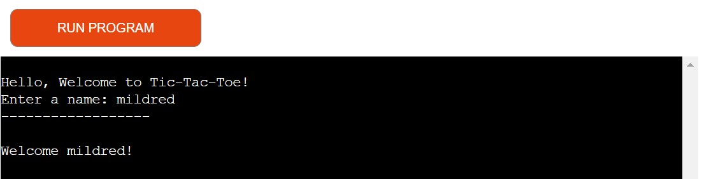

# Tic-Tac-Toe

##
The Tic Tac Toe is a simple snd interesting text base game implemented in Python. This project allows two players to take turns and play the classic 3x3 grid game directly in the terminal.

[Deployed Game Link](https://x-and-o-app-d0670438d457.herokuapp.com/)

### UI/UX

### User goals

#### Website owner goals
- The website aims to provide a simple and fun text-based Tic Tac Toe game.
- The website creates an engaging user experience that runs smoothly in a terminal environment.
- The website allows users to play games, with an option to replay or quit.

#### New Users
- The user would easily understand the rules of Tic Tac Toe through clear instructions displayed at the start of the game.                                         
- The numbered reference board is present to enable users understand how to make moves.                                          
- A clear and prompt feedback for validating a valid input and an invalid input.
- The users enjoys a clean, user-friendly interface that updates dynamically after every move.
- A clear message pops on the screen when the game ends in a win, loss, or tie.

#### Returning visitors
- Seamlessly play again using the replay option without needing to restart the program.
- Enjoy enhanced performance with bug-free functionality and responsive inputs.

### Flow Chart
To create the structure of the game, this diagram was created using
 [Lucid Charts](https://www.lucidchart.com/)
 

 ### Game Features

 Here's what the program does and how the game plays:

1. This option asks the user to input name and welcomes the user after the name input.

2. Once the user inputs their name, the program gives the user the option of (yes/no) to play the game.

3. If user inputs no, it takes the user back to welcome.

4. This option gives an initial briefing to the user; User is assigned X and computer is assigned O, The Choice is up to the user to either play the game,read the rules or quit the game.

5. If the user selects to read the rules of the game, a description appears and then the user gets asked to select another options from playing or quitting the game.

6. If the user chooses to quit the game, a thank you message appears on the screen and the program restarts again, ready to be used.

7. If the user chooses to play,a simple instruction is shown and a board layout for reference and the user takes the turn to play first by choosing the first input or user may decide to quit.

8. If user decides to quit,it ends the game and notify that player has quit the game.

9. If user proceeds and make an input between 0-8,the input is shown on the board aswell as the available moves for the next player afterwhich,the computer also makes a move then the program asks for the next move from the user.

10. The prompt for a choice will continue until there is a winner or players runs out of move thereby making it a tie. A feedback message will display in both cases and then an option for user to either restart the game or end the game.
