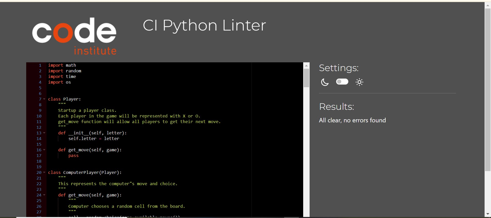
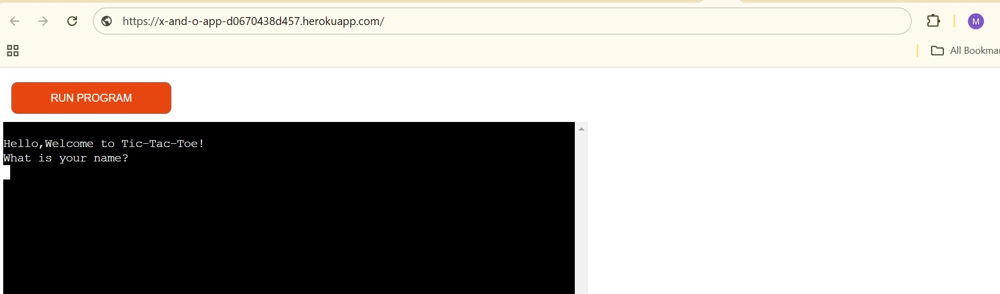

# Tic-Tac-Toe

##
The Tic Tac Toe is a simple and interesting text base game implemented in Python. This project allows two players to take turns and play the classic 3x3 grid game directly in the terminal.

[Here is the live version of my project](https://x-and-o-app-d0670438d457.herokuapp.com/)

### UI/UX
---

### User goals

#### Website owner goals
- The website aims to provide a simple and fun text-based Tic Tac Toe game.
- The website creates an engaging user experience that runs smoothly in a terminal environment.
- The website allows users to play games, with an option to replay or quit.

#### New Users
- The user would easily understand the rules of Tic Tac Toe through clear instructions displayed at the start of the game.                                         
- The numbered reference board is present to enable users understand how to make moves.                                          
- A clear and prompt feedback for validating a valid input and an invalid input.
- The users enjoys a clean, user-friendly interface that updates dynamically after every move.
- A clear message pops on the screen when the game ends in a win, loss, or tie.

#### Returning visitors
- Seamlessly play again using the replay option without needing to restart the program.
- Enjoy enhanced performance with bug-free functionality and responsive inputs.

### Flow Chart
---
To create the structure of the game, this diagram was created using
 [Lucid Charts](https://www.lucidchart.com/)
 

 ### Game Features
 ---

 Here's what the program does and how the game plays:

1. This option asks the user to input name and welcomes the user after the name input.

2. Once the user inputs their name, the program gives the user the option of (yes/no) to play the game.

3. If user inputs no, it takes the user back to welcome.

4. This option gives an initial briefing to the user; User is assigned X and computer is assigned O, The Choice is up to the user to either play the game,read the rules or quit the game.

5. If the user selects to read the rules of the game, a description appears and then the user gets asked to select another options from playing or quitting the game.

6. If the user chooses to quit the game, a thank you message appears on the screen and the program restarts again, ready to be used.

7. If the user chooses to play,a simple instruction is shown and a board layout for reference and the user takes the turn to play first by choosing the first input or user may decide to quit.

8. If user decides to quit,it ends the game and notify that player has quit the game.

9. If user proceeds and make an input between 0-8,the input is shown on the board aswell as the available moves for the next player afterwhich,the computer also makes a move then the program asks for the next move from the user.

10. The prompt for a choice will continue until there is a winner or players runs out of move thereby making it a tie. A feedback message will display in both cases and then an option for user to either restart the game or end the game.

### Future Features to Implement
---

- Introduce a scoreboard to track wins, losses, and ties across multiple games.
- Introduce a custom board sizes that allow users to play on larger grids, such as 4x4 or 5x5.
- An enhanced UI that add colour-coded symbols and animations for a more interactive experience.

### Technologies Used
---

- JavaScript - generated from the python essential template build by Code Institute.
- GitHub - Version control.
- GitPod - IDE used to code the program and for some of the manual testing.
- Heroku - Program deployment for the users to access it without deploy it themselves.

### Libraries Used
---

- Math - for calculation and managment of numbers and data types.
- Random - to randomize the choices of the computer player.
- Time -Adds pauses between moves for better user readability.
- Os -  Used to clear the terminal screen for a clean UI.

### Testing and Validation
---

The code was checked with PEP8 validator and passed with no error found.

 
### Manual testing
---

- Inputs:
Tested with valid moves (e.g., selecting empty cells) and tested with invalid inputs (e.g., selecting occupied cells or entering non-numeric values).
- Win Detection:Verified that the game correctly detects wins for all possible winning combinations (rows, vertical, horizontal and diagonal).
- Tie Detection:Confirmed that the game declares a tie when all cells are filled without a winner.
- Replay Option:Checked the functionality of restarting the game after each round.

#### Browser Compactibility

Testing was completed in Google Chrome, Microsoft Edge and Firefox web browsers.

- Google Chrome

- Microsoft edge

- Firefox

### User stories testing

|    User Story   |   How It Was Achieved   |
| ------------- | ------------- |
| I want to easily understand the game rules.  | Clear instructions are displayed at the start of the game |
| I want to see the board after every move. | The board updates dynamically and displays after every turn. |
| I want to avoid invalid moves.  | Input validation ensures only valid moves are allowed  |
| I want to play multiple rounds if I wish.  | Replay functionality is included to restart the game easily.  |

### Bugs

|    Issues   |   Fix   |
| ------------- | ------------- |
| Players could select occupied cells.  | Added checks to ensure only empty cells can be selected. |
| Invalid input (e.g., letters or special characters) caused crashes. | Added input validation to handle non-numeric values.  |
| The program raised an IndentationError.  | Added extra spaces in-between command line prompt to help visual clarity for the userand avoid errors.  |

### Unfixed Bugs
- No bugs remaining

## Deployment

Here’s a guide for manually deploying the project to Heroku using a GitHub repository:

### Deployment Steps:

- **1. Create a Heroku Account**
    - Visit [Heroku](https://dashboard.heroku.com/) and sign up for an account.

- **2. Create a New App**
    - Go to the Heroku dashboard and click **new**.
    - On the dropdown click **Create new app**.
    - Provide a unique app name and select your region then click **Create app**.

- **3. Add Buildpacks**
    - In the **Settings** tab, click **Add buildpack**.
    - Select **Python** and **Node.js** (if needed), ensuring that Python is listed first.

- **4. Connect to GitHub**
    - In the **Deploy** tab, choose **GitHub** as the deployment method.
    - Search for your repository and connect it to Heroku.

- **5. Manual or Automatic Deploy**
    - Enable **Automatic Deploys** for Heroku to update the app with every push to GitHub, or use the **Manual Deploy** option to deploy the main branch manually.

- Your code must be placed in the `run.py` file
- Your dependencies must be placed in the `requirements.txt` file

## Creating the Heroku app

When you create the app, you will need to add two buildpacks from the _Settings_ tab. The ordering is as follows:

1. `heroku/python`
2. `heroku/nodejs`

You must then create a _Config Var_ called `PORT`. Set this to `8000`

Connect your GitHub repository and deploy as normal.

### Credits
---

- [Python Classmethods and Staticmethods](https://www.youtube.com/watch?v=rq8cL2XMM5M)
- [Python if __name__ == __main__ Explained with Code Examples](https://www.freecodecamp.org/news/if-name-main-python-example/#:~:text=We%20can%20use%20an%20if,name%20if%20it%20is%20imported.)
- [Python Tutorial: if __name__ == '__main__'](https://www.youtube.com/watch?v=sugvnHA7ElY)
- [12 Beginner Python Projects](https://www.youtube.com/watch?v=8ext9G7xspg&t=2189s)
- [Tic Tac Toe definition - Collins Dictionary](https://www.collinsdictionary.com/dictionary/english/tic-tac-toe#:~:text=Tic%2Dtac%2Dtoe%20is%20a,same%20symbols%20in%20a%20row.)
- Code Institute love running project

### Acknowlegement 

- Vernell Clark for his continuous guidance, insightful feedback, and unwavering support throughout the project which helped refine my approach and ensured the project meet a good standard.(https://github.com/VCGithubCode)